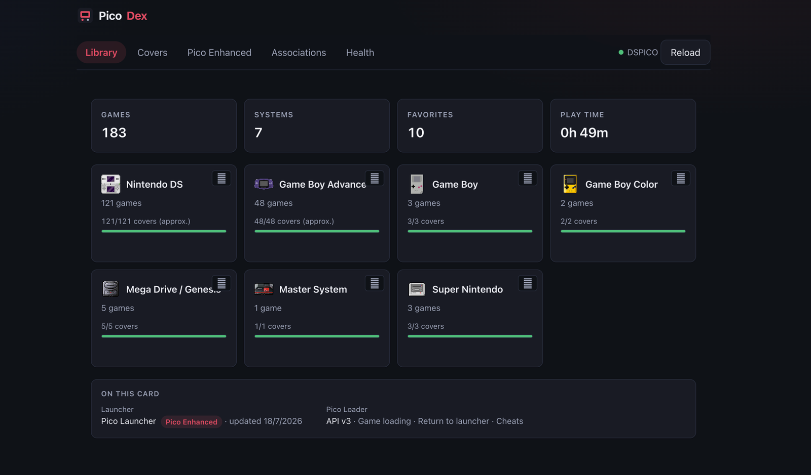
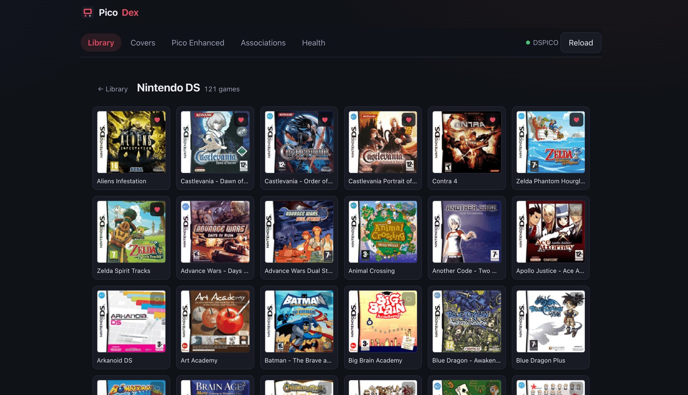
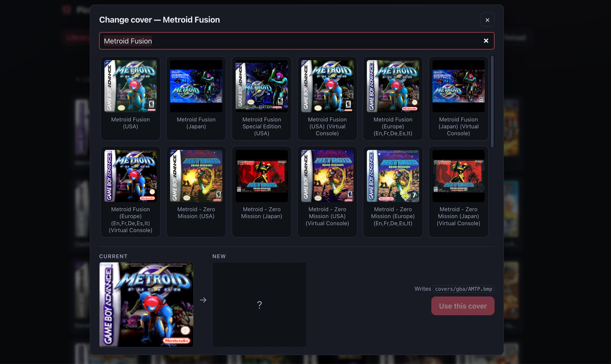
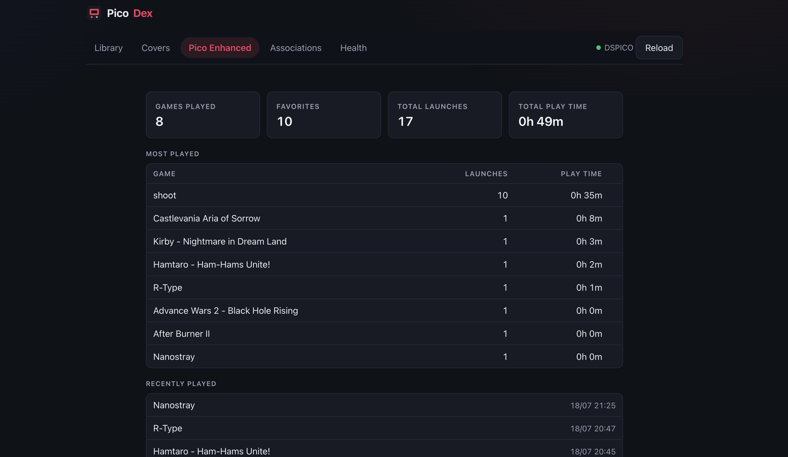

# PicoDex

[](https://github.com/rasalopa/picodex/actions/workflows/ci.yml)
[](https://rasalopa.github.io/picodex/)
[](https://github.com/rasalopa/picodex/releases)
[](LICENSE)

> Manage your [DSpico](https://github.com/LNH-team/dspico) SD card from the browser — covers, library organization, favorites and play stats. No install, no backend, your files never leave your machine.



<table>
  <tr>
    <td width="50%"></td>
    <td width="50%"></td>
  </tr>
  <tr>
    <td width="50%"></td>
    <td width="50%"></td>
  </tr>
</table>

## What it does

- 📂 **Open your SD card** directly in the browser (File System Access API) and see your whole library at a glance: games per system, cover coverage, and — if you use [Pico Launcher Enhanced](https://github.com/rasalopa/pico-launcher-enhanced) — your favorites, completed games and play stats.
- 🖼 **Cover manager**: finds games without box art, matches them against the [libretro-thumbnails](https://github.com/libretro-thumbnails) catalogs (No-Intro naming, region-aware), previews the result and writes launcher-ready BMPs to `/_pico/covers/`.
- 🎮 **Library organizer**: drop ROM files onto the page — PicoDex detects the system, places them under `Games/`, and fetches their covers.
- 📁 **Folder banners**: give each system folder a proper icon and display name (`banner.bnr`), generated in the browser.
- 🔗 **File association editor**: point each ROM extension at its emulator without hand-editing `settings.json`.

Everything runs client-side. PicoDex has no server, no accounts and no telemetry.

## Requirements

- A Chromium-based browser (Chrome, Edge, Brave, Opera). Firefox and Safari do not yet ship the directory-write File System Access API.
- A DSpico SD card (any card with a `/_pico` folder).

## Using it

**Use it now: https://rasalopa.github.io/picodex/** — no install needed.

Or run it locally:

```bash
git clone https://github.com/rasalopa/picodex.git
cd picodex
npm install
npm run dev
```

Open the printed URL, click **Open SD card**, and pick your mounted SD.

## Development

```bash
npm run dev          # dev server
npm test             # unit tests (vitest)
npm run lint         # eslint
npm run format:check # prettier
npm run build        # production build
```

The interesting logic lives in [`src/lib/`](src/lib/) as pure, dependency-free TypeScript: NDS/GBA header parsing, launcher-format BMP encoding, `banner.bnr` building, box-art title matching, and the Pico Launcher `gamedata.json`/`settings.json` formats. The React app is a thin shell over it.

See [CONTRIBUTING.md](CONTRIBUTING.md) if you want to help.

## Acknowledgements

- The [LNH team](https://github.com/LNH-team) for DSpico and Pico Launcher — the open flashcart that makes this fun.
- [libretro-thumbnails](https://github.com/libretro-thumbnails) for the box art collections.

## License

[MIT](LICENSE)
